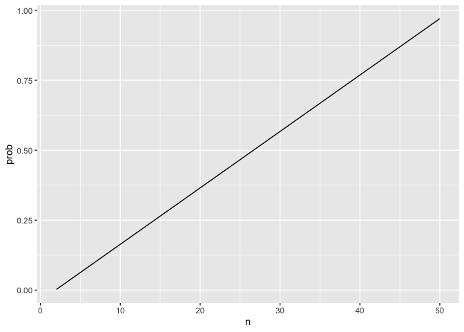
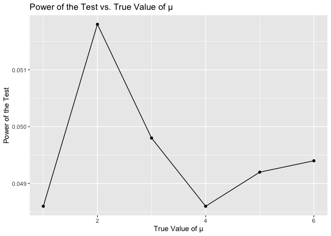
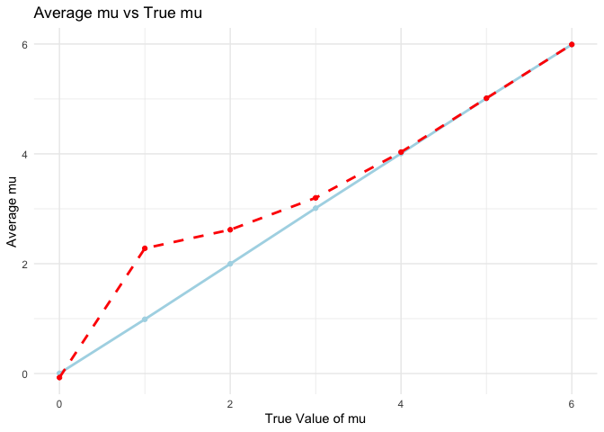
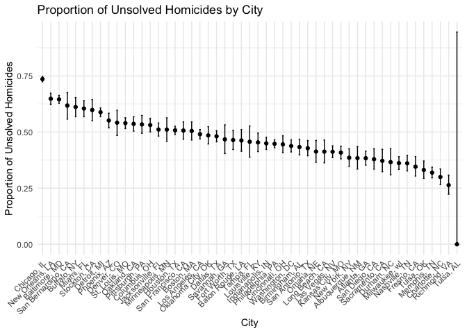

Homework 5
================
Sihan Qiu

``` r
library(tidyverse)
```

    ## ── Attaching core tidyverse packages ──────────────────────── tidyverse 2.0.0 ──
    ## ✔ dplyr     1.1.4     ✔ readr     2.1.5
    ## ✔ forcats   1.0.0     ✔ stringr   1.5.1
    ## ✔ ggplot2   3.5.1     ✔ tibble    3.2.1
    ## ✔ lubridate 1.9.3     ✔ tidyr     1.3.1
    ## ✔ purrr     1.0.2     
    ## ── Conflicts ────────────────────────────────────────── tidyverse_conflicts() ──
    ## ✖ dplyr::filter() masks stats::filter()
    ## ✖ dplyr::lag()    masks stats::lag()
    ## ℹ Use the conflicted package (<http://conflicted.r-lib.org/>) to force all conflicts to become errors

``` r
set.seed(1)
```

## Q1

``` r
bdays_sim = function(n){

bdays = sample(1:365, size = n, replace = TRUE)

duplicate = length(unique(bdays)) < n  #check repeated birthdays
return(duplicate)
}

bdays_sim(10)
```

    ## [1] FALSE

``` r
sim_res =
  expand_grid(
    n = c(2, 50),
    iter = 1:10000
  )|>
  mutate(res = map_dbl(n,bdays_sim))|>
  group_by(n)|>
  summarize(prob = mean(res))

sim_res|>
  ggplot(aes(x = n, y = prob))+
  geom_line()
```

<!-- -->

## Q2

``` r
t_sample = function(mu) {
  sample_data = rnorm(n = 30, mean = mu, sd = 5)
  t_result = broom::tidy(t.test(sample_data, mu = 0)) |>
  select(estimate, p.value)
  
  return(t_result)
}
```

``` r
simulation_df = expand_grid(
  true_mu = 0:6,     
  iteration = 1:5000  
)
```

``` r
simulation_results =
  simulation_df |>
  mutate(
    result = map(true_mu, t_sample)  
  ) |>
  unnest(result) 
```

``` r
power_sum =
  simulation_results |>
  group_by(true_mu) |>
  summarize(
    power = mean(p.value < 0.05),  
    average_mu = mean(estimate),  
    .groups = "drop"
  )
```

## power of the test plot

``` r
power_plot =
  ggplot(power_sum, aes(x = true_mu, y = power)) +
  geom_line() +
  geom_point() +
  labs(
    x = "True Value of mu",
    y = "Power",
    title = "Power vs True mu"
  ) +
  theme_minimal()
power_plot
```

<!-- -->
\###description: we can see a positive relationship between effect size
and power. When the effect size increases, the power increases. Vice
versa.

``` r
average_results = 
  simulation_results |>
  group_by(true_mu) |>
  summarize(
    average_mu = mean(estimate),  
    average_mu_rej = mean(estimate[p.value < 0.05], na.rm = TRUE),  
    .groups = "drop"
  )
```

## average and true mean plot

``` r
average_plot =
  ggplot(average_results) +
  geom_line(aes(x = true_mu, y = average_mu), color = "lightblue", linewidth = 1) +
  geom_point(aes(x = true_mu, y = average_mu), color = "lightblue") +
  geom_line(aes(x = true_mu, y = average_mu_rej), color = "red", linetype = "dashed", linewidth = 1) +
  geom_point(aes(x = true_mu, y = average_mu_rej), color = "red") +
  labs(
    title = "Average mu vs True mu",
    x = "True Value of mu",
    y = "Average mu"
  ) +
  theme_minimal()
average_plot
```

<!-- -->
\### Explainaiton The sample average of mu across tests where the null
is rejected is not equal to the true value of mu. Because the small
sample size of mu, which makes the result bias (maybe distorted by some
extreme values).

## Q3

``` r
homicide = read.csv("homicide-data.csv")|>
  janitor::clean_names()
```

### description of the raw dataset

the raw dataset includes 52179 observations, and 12 variables. Key
variables includes homicides’ id, dates, victims’ names, race, age, sex,
state, city, and disposition of homicides, and the specific location.

``` r
homicide_clean = 
  homicide |>
  mutate(
    victim_last = str_to_title((victim_last)),
    victim_first = str_to_title((victim_first)),
    city_state = paste(city, state, sep = ", ")
  )|>
  drop_na()
```

``` r
homicide_clean|>
  group_by(city_state) |>
  summarise(
    total = n(),
    unsolved = sum(disposition %in% c("Closed without arrest", "Open/No arrest"))
  )
```

    ## # A tibble: 51 × 3
    ##    city_state      total unsolved
    ##    <chr>           <int>    <int>
    ##  1 Albuquerque, NM   375      144
    ##  2 Atlanta, GA       973      373
    ##  3 Baltimore, MD    2827     1825
    ##  4 Baton Rouge, LA   424      196
    ##  5 Birmingham, AL    799      346
    ##  6 Boston, MA        612      309
    ##  7 Buffalo, NY       520      318
    ##  8 Charlotte, NC     687      206
    ##  9 Chicago, IL      5535     4073
    ## 10 Cincinnati, OH    694      309
    ## # ℹ 41 more rows

## proportion of baltimore

``` r
baltimore_df = 
  homicide_clean|>
  filter(city_state == "Baltimore, MD")
```

``` r
total_bal = nrow(baltimore_df)
unsolved_bal = sum(pull(baltimore_df, disposition) %in% c("Closed without arrest", "Open/No arrest"))
```

``` r
prop_test = prop.test(x = unsolved_bal, n = total_bal)
prop_test_df = broom::tidy(prop_test)
prop_test_df
```

    ## # A tibble: 1 × 8
    ##   estimate statistic  p.value parameter conf.low conf.high method    alternative
    ##      <dbl>     <dbl>    <dbl>     <int>    <dbl>     <dbl> <chr>     <chr>      
    ## 1    0.646      239. 6.46e-54         1    0.628     0.663 1-sample… two.sided

## proportion of each city

``` r
city_prop =
  homicide_clean |>
  group_by(city_state) |>
  summarise(
    total_cases = n(),
    unsolved_cases = sum(disposition %in% c("Closed without arrest", "Open/No arrest")),
    .groups = "drop"
  ) |>
  mutate(
    prop_results = map2(
      unsolved_cases, total_cases,
      ~ prop.test(.x, .y, correct = TRUE)  
    ),
    
    tidy_results = map(prop_results, broom::tidy)
  ) |>

  unnest(tidy_results) |>
  
  select(
    city_state,
    estimate = estimate,  
    conf.low, 
    conf.high 
  )
```

    ## Warning: There was 1 warning in `mutate()`.
    ## ℹ In argument: `prop_results = map2(unsolved_cases, total_cases, ~prop.test(.x,
    ##   .y, correct = TRUE))`.
    ## Caused by warning in `prop.test()`:
    ## ! Chi-squared approximation may be incorrect

``` r
city_prop_df =
  city_prop |>
  arrange(desc(estimate)) |>  
  mutate(city_state = factor(city_state, levels = city_state)) 
```

## making a plot

``` r
prop_plot =
  ggplot(city_prop_df, aes(x = city_state, y = estimate)) +
  geom_point() +  
  geom_errorbar(aes(ymin = conf.low, ymax = conf.high), width = 0.2) +  
  labs(
    title = "Proportion of Unsolved Homicides by City",
    x = "City",
    y = "Proportion of Unsolved Homicides"
  ) +
  theme_minimal() +
  theme(axis.text.x = element_text(angle = 45, hjust = 1))  
print(prop_plot)
```

<!-- -->
