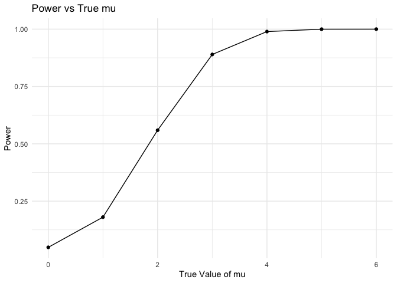

Homework 5
================
Sihan Qiu

``` r
library(tidyverse)
```

    ## ── Attaching core tidyverse packages ──────────────────────── tidyverse 2.0.0 ──
    ## ✔ dplyr     1.1.4     ✔ readr     2.1.5
    ## ✔ forcats   1.0.0     ✔ stringr   1.5.1
    ## ✔ ggplot2   3.5.1     ✔ tibble    3.2.1
    ## ✔ lubridate 1.9.3     ✔ tidyr     1.3.1
    ## ✔ purrr     1.0.2     
    ## ── Conflicts ────────────────────────────────────────── tidyverse_conflicts() ──
    ## ✖ dplyr::filter() masks stats::filter()
    ## ✖ dplyr::lag()    masks stats::lag()
    ## ℹ Use the conflicted package (<http://conflicted.r-lib.org/>) to force all conflicts to become errors

``` r
set.seed(1)
```

## Q1

``` r
bdays_sim = function(n){

bdays = sample(1:365, size = n, replace = TRUE)

duplicate = length(unique(bdays)) < n  #check repeated birthdays
return(duplicate)
}

bdays_sim(10)
```

    ## [1] FALSE

``` r
sim_res =
  expand_grid(
    n = c(2, 50),
    iter = 1:10000
  )|>
  mutate(res = map_dbl(n,bdays_sim))|>
  group_by(n)|>
  summarize(prob = mean(res))

sim_res|>
  ggplot(aes(x = n, y = prob))+
  geom_line()
```

<!-- -->

## Q2

``` r
sim_mean_sd = function(n, mu = 0, sigma = 5) {
  
  sim_data = tibble(
    x = rnorm(n, mean = mu, sd = sigma)
  )
  sim_data |>
    summarize(
      mu_hat = mean(x),
      sigma_hat = sd(x)
    )
  
  test_result = 
    t.test(sim_data[["x"]], mu = 0)
  
  result = broom::tidy(test_result)
  
  tibble(
    mu_hat = mean(sim_data[["x"]]),
    sigma_hat = sd(sim_data[["x"]]),
    p_value = result[["p.value"]]
  )
}
```

``` r
params = list(
  n = 30,
  sigma = 5,
  alpha = 0.05,
  mu_values = c(1, 2, 3, 4, 5, 6),
  num_simulations = 5000
)
```

``` r
sim_results = map_df(params[["mu_values"]], function(mu)
{
  output= vector("list", 5000)
  
  for (i in 1:5000) {
  output[[i]] = sim_mean_sd(30)
  }
  bind_rows(output) |>
  mutate(true_mu = mu)
})
```

``` r
power_results = 
  sim_results |>
  group_by(true_mu) |>
  summarize(
    power = mean(as.numeric(p_value) < params[["alpha"]]),                      
    avg_estimate = mean(mu_hat),                       
    avg_estimate_rejected = mean(mu_hat[as.numeric(p_value) < params[["alpha"]]])
  )
```

``` r
ggplot(power_results, aes(x = true_mu, y = power)) +
  geom_line() +
  geom_point() +
  labs(x = "True Value of μ", y = "Power of the Test",
       title = "Power of the Test vs. True Value of μ")
```

<!-- -->

``` r
ggplot(power_results, aes(x = true_mu)) +
  geom_line(aes(y = avg_estimate), color = "blue", linetype = "solid") +
  geom_point(aes(y = avg_estimate), color = "blue") +
  geom_line(aes(y = avg_estimate_rejected), color = "red", linetype = "dashed") +
  geom_point(aes(y = avg_estimate_rejected), color = "red") +
  labs(x = "True Value of μ", y = "Average Estimate of μ̂",
       title = "Average μ̂ vs. True Value of μ",
       subtitle = "Blue: All Estimates, Red: Only Rejected Null Hypothesis") +
  theme_minimal()
```

<!-- -->
